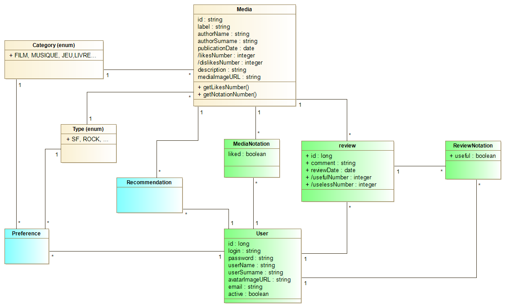

# Projet Fil Rouge - FRONT - BNP Paribas Epita 
​
## Projet
Le projet fil rouge consiste à créer un site permettant aux utilisateurs de donner leur avis (like / dislike) et de mettre des commentaires sur des médias (livre, film, musique
jeux de rôles). 
Des recommandations sont adressées aux utilisateurs du site en fonction des avis déjà partagés. 

Le projet FRONT stocké ici fonctionne avec le projet [BACK](https://github.com/marmai-jma/Project_Back)

Ce projet a été généré avec [Angular CLI](https://github.com/angular/angular-cli) version 8.3.19.

## Mode opératoire
Sur un serveur de développement, après installation des parties FRONT et BACK stockées sur git.

* Lancer le projet BACK (via `run` sur ProjectApplication dans l'IDE Intellij) Par défaut, le projet BACK tourne sur `http://localhost:8080/` 
* Lancer le projet FRONT (avec la commande `ng serve` dans Visual Studio).
* Aller sur [`http://localhost:4200/`](http://localhost:4200/).
* Une liste de médias s'affiche. 

## Logins utilisateurs de test
A ce stade du développement du projet, il n'est pas possible de créer de nouveaux médias, ni de nouveaux utilisateurs. 

Plusieurs logins de test sont mis à disposition au chargement de la base h2. 

    Bilbo123
    moi
    toi
    lui

## Éléments de conception

Modèle de données: 

- la partie jaune correspond au MVP (Minimal Viable Product).
- la partie verte correspond au MMP (Minimal Marketable Product).
- la partie bleue correspond au produit final. 

Maquettage de l'application:
[Maquette](https://xd.adobe.com/view/1fafd22d-40a7-4d9a-7805-e749a0fde62e-699e/)

## Versions du projet
En MVP, le projet devait prendre en charge l'affichage à l'écran de la liste des médias présents dans la base h2.

En MMP, la possibilité pour un utilisateur existant de liker/disliker un média et d'émettre un avis persisté en base h2 sur ce média a été ajoutée.

En version actuelle, des recommandations sont proposées aux utilisateurs en fonction des like et des dislikes émis et il est possible de visualiser les informations utilisateur associées à un login. 

En version finale, il sera possible de créer des médias, de nouveaux utilisateurs, de gérer la connexion sécurisée, de liker/disliker un média depuis la liste de la première page et d'émettre un avis utile/inutile sur le commentaire d'un autre utilisateur. 